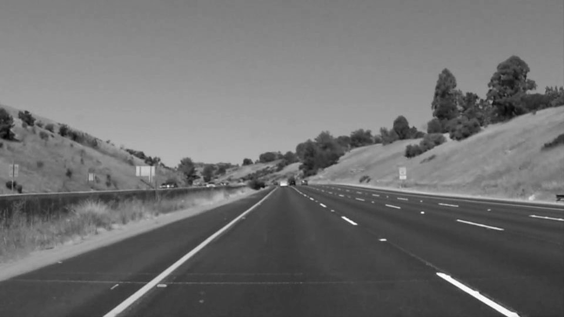
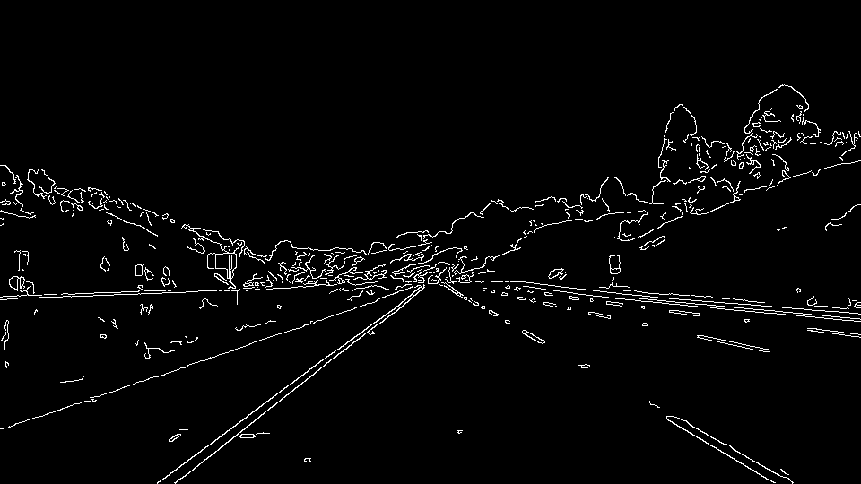
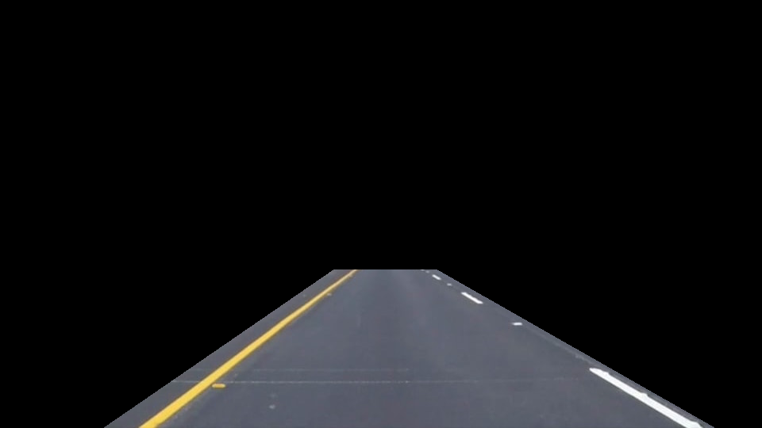
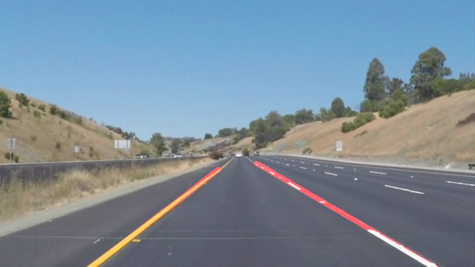

# **Finding Lane Lines on the Road** 

## Writeup Template

### You can use this file as a template for your writeup if you want to submit it as a markdown file. But feel free to use some other method and submit a pdf if you prefer.

---

**Finding Lane Lines on the Road**

The goals / steps of this project are the following:
* Make a pipeline that finds lane lines on the road
* Reflect on your work in a written report

[//]: # (Image References)

[gray]: ./my_examples/grayscale.jpg "Grayscale"
[blur]: ./my_examples/gaussian_blur.jpg "Gaussian Blur"
[edges]: ./my_examples/edges.jpg "Canny Edge Detection"
[mask]: ./my_examples/mask.jpg "Specified Region"
[initial]: ./my_examples/whiteCarLaneSwitch.jpg "whiteCarLaneSwitch initial state"
[final]: ./my_examples/lanes.jpg "whiteCarLaneSwitch w/ Lane Detection"

---

### Reflection

My pipeline consists of 5 steps. 
---
  - Took a copy of the image, to avoid affecting the input image.
  
  

  
  - Applied the helper function grayscale on the image.
  
  

  
  - Smoothed the image using the Gaussian Blur function on the image using a Kernel Size of 5x5 
  - Detected the image's edges using the Canny Edge Detection function, with a ratio of 1:2 through a low_threshold @ 100 and a
      high threshold @ 200.
      
      

      
  - Constructed a polygon mask for every image by determining 4 vertices across the image. Using approximate ratios with respect to
      the image's specific dimensions calculated by variables xsize & ysize.
      
      

      
  - Transformed the masked part of the image to a Hough Space, using the Hough Lines function, determining the lines connecting the            Edge points previously collected through the Canny function. These lines were filtered according to several parameters which              took a lot of trials and logic to determine, including: the vote threshold of line intersections in a single grid space, the              minimum line length and maximum line gap.
  
  - These lines are passed to the draw_lines function to be drawn on a blank image with the same dimensions as the input, which was completely rewritten.
      * The points were filtered to two seperate arrays representing the left and the right lanes by dividing the lines on the left               of the image and on the right.
      * Furthermore, I had to use a slope filter to avoid anypoints that might be included within the mask perimeter but aren't lane               lines.
          - For Example: In the challenge video, the car hood disturbed the lines drastically due to lines detected with slopes = 0.
      * The functions polyfit, poly1d and polylines were used to get a fitting set of points for the lines set as the left and right lane, create a function of the first degree for the fitting points, and draw a line across the points specifying the left and right lanes. 
  
  - Merged the lines drawn and input image using the weighted image function.
  
  

  

![alt text][image1]

### 2. Identify potential shortcomings with your current pipeline

One potential shortcoming would be what would happen when ... 

Another shortcoming could be ...

### 3. Suggest possible improvements to your pipeline

A possible improvement would be to ...

Another potential improvement could be to ...
